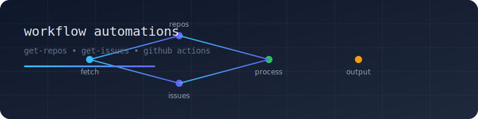

# bkness-stats

> **Automated GitHub Stats & Badges for bkness**

This repository powers dynamic badges for bkness’s public repositories and issues, using GitHub Actions and public gists.

## Dynamic Badges

## What is this?

- **Automates**: Counting public repos and issues for the bkness org/user.
- **Updates**: Gists with the latest stats on a schedule (via GitHub Actions).
- **Displays**: Live badges (above) using [shields.io](https://shields.io) and public gists.

## How it works

- GitHub Actions run every hour (or on demand) to update gists with the latest stats.
- Badges above fetch their data from those gists.

## Usage

- Fork or use as a template for your own stats/badges.
- Customize the workflow YAMLs and badge URLs for your own org/user and gists.

---

Made with ❤️ by [bkness](https://weballtech.com)
